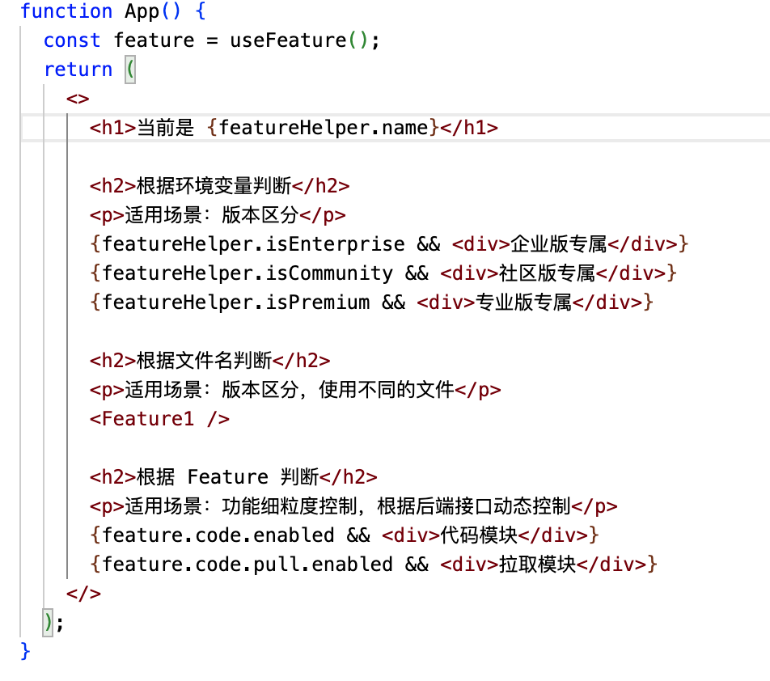
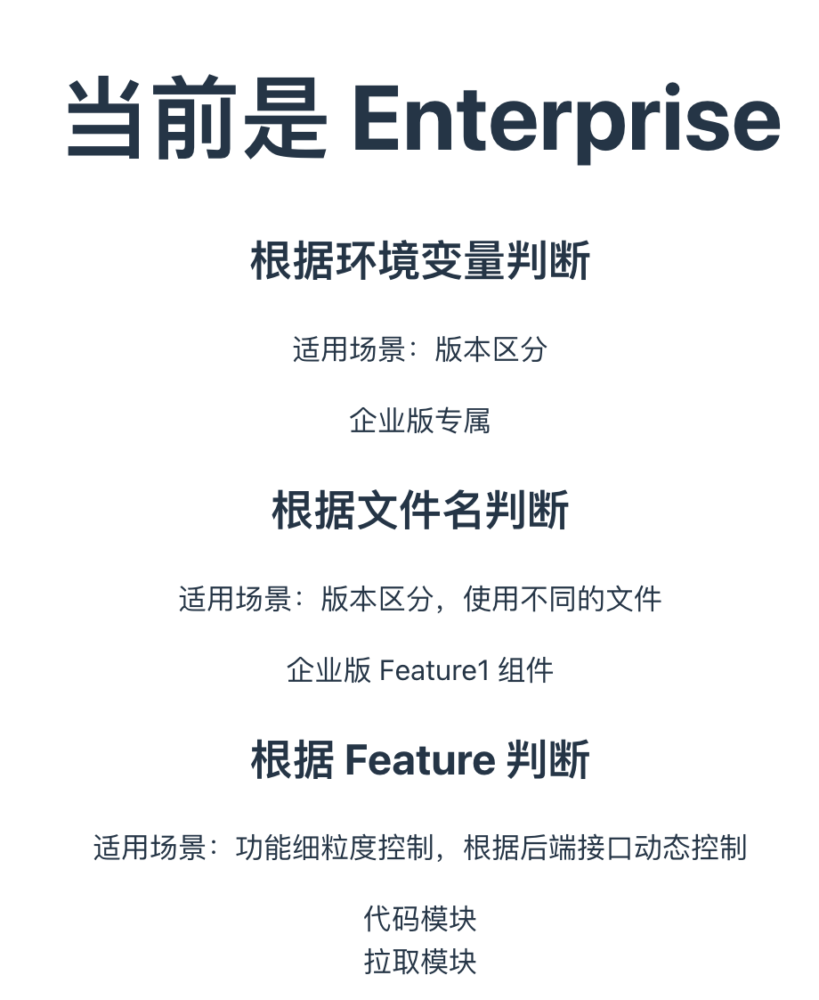
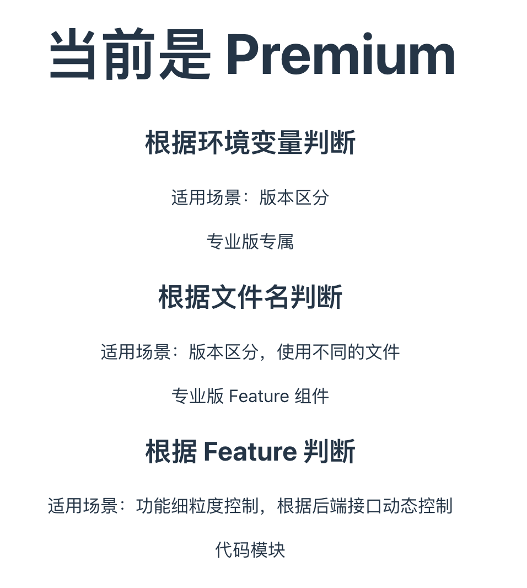
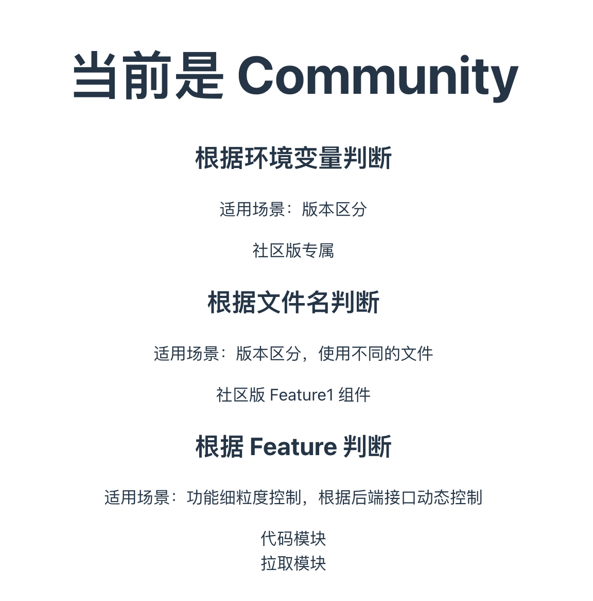

# 一份代码，部署于不同客户环境

## 需求

在主线分支上开发，部署到不同客户环境。

## 场景

- 企业版
- 专业版
- 社区版

## 实现

### 简单判断区分

版本之间差异

### 文件名区分

不同版本使用不同文件

### 功能开关

- 细粒度控制
- 根据后端接口动态控制

## DEMO

**代码**

**企业版**

**专业版**

**社区版**

